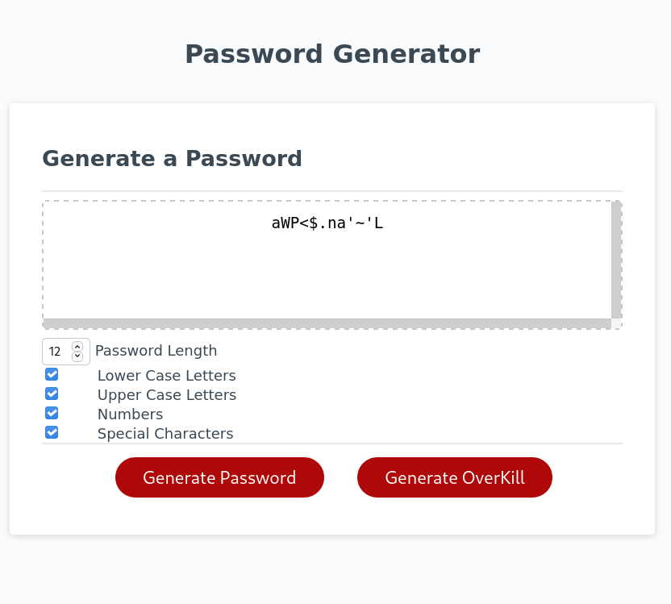

## SOMEWHAT SECURE BUT NOT REALLY PASSWORD GENERATOR
This password generator uses the Window.Crpyto API to generate random 32 bit unsigned intergers. Then it uses modulo to narrow that down to the available character set selected by the user. The generate overkill button generates at 8100 long password and posts out chucks while doing so.

